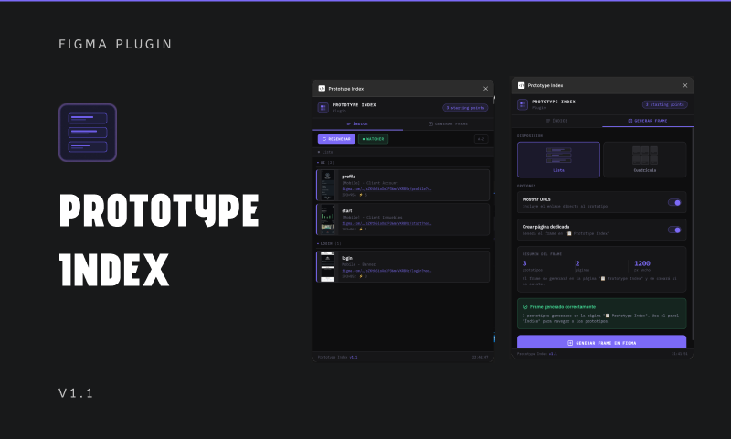

# Figma Prototype Index Plugin



A Figma plugin that generates a visual index of all prototype starting points in your file, making it easy to navigate and document your prototypes.

## Features

- 📋 Automatically scans all pages for prototype starting points
- 🎨 Generates a beautiful index frame with cards for each prototype
- 📱 Two layout options: List and Grid
- 🔗 Displays prototype URLs (when file is saved to cloud)
- 👁️ Real-time watcher to detect prototype changes
- 🎯 Click-to-navigate from the UI panel

## Installation

### Development Mode

1. Clone this repository
2. Open Figma Desktop App
3. Go to Plugins → Development → Import plugin from manifest
4. Select the `manifest.json` file from this repository

## Usage

1. Open the plugin from Plugins → Prototype Index
2. The plugin will automatically scan your file for prototype starting points
3. Use the "Índice" tab to see the list of prototypes and navigate to them
4. Use the "Generar Frame" tab to create a visual index frame in your file

### Generate Frame Options

- **Layout**: Choose between List or Grid layout
- **Show URLs**: Display prototype URLs on cards (requires file to be saved to cloud)
- **Dedicated Page**: Create the index on a separate "📋 Prototype Index" page

## Requirements

- Figma Desktop App or Figma in browser
- File must be saved to Figma cloud for prototype URLs to work

## Development

### Setup

```bash
npm install
```

### Testing

```bash
npm test
```

## Technical Details

- Uses Figma's `flowStartingPoints` API to detect prototype starting points
- Generates frames with proper styling and layout
- Includes property-based tests for correctness validation

## License

MIT

## Contributing

Contributions are welcome! Please feel free to submit a Pull Request.
